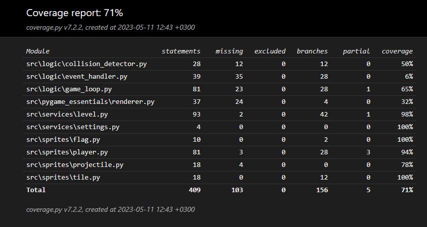

# Testausdokumentti

Peliä on testattu automatisoiduin yksikkö- ja integraatiotestein pythonin unittest-moduulilla.

## Haarautumakattavuus

Automatisoitujen testien haarautumakattavuus on 71%

## Toiminnallisuudet

Kaikki [vaatimusmäärittelydokumentin](https://github.com/Robomarti/harjoitustyo/blob/master/dokumentaatio/vaatimusmaarittely.md) ja käyttöohjeen toiminnallisuudet on käyty läpi, ja niiden on todettu toimivan. Virheelliset syötteet eivät ole ongelma pelin luonteen vuoksi.

## Sovelluksen laatuongelmat

Sovellus ei anna virheilmoitusta mikäli settings.py tiedoston sisältöjä muokataan virheellisesti, mutta se antaa yleisesti varoituksen mahdollisesti virheellisestä tiedostosta jos mikä tahansa aiheuttaa pelin kaatumisen.

Oma lippu voi poistua pelistä jos se putoaa omaan uudelleensyntymispaikkaan ja liikut siihen paikkaan.