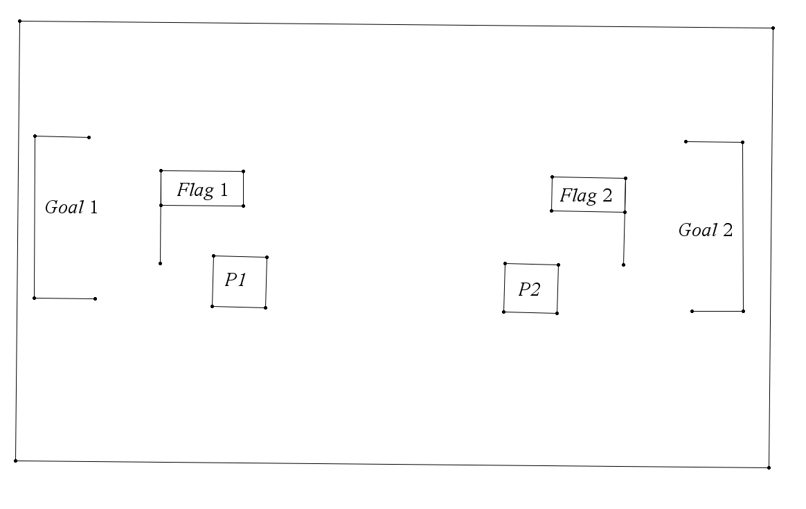

# Vaatimusmäärittely

## Sovelluksen tarkoitus

Sovelluksen tarkoitus on olla pieni kaksinpelattava peli, jossa pelaajat yrittävät vallata toistensa liput ja kuljettaa sen omaan maaliinsa.

## Suunnitellut toiminnallisuudet
  
### Pelin ulkonäkö

- Peli toteutetaan 2d:nä, ja sitä pelataan ylhäältä katsotusta kuvakulmasta.

### Pelin pelaaminen

- Peliä pelataan vuorotellen samalla tietokoneella, pelaaja 1 aloittaa. TEHTY
- Vuorot pelataan salassa, esimerkiksi kääntämällä näytön poispäin toisesta pelaajasta
- Aika on "pysähtynyt" vuorojen aikana, ja molempien pelaajien toiminnot tapahtuvat samaan aikaan, kun pelaaja 2 on valmis lopettamaan vuoronsa.
- Vuoronsa aikana pelaajalla on kaksi mahdollista toimintoa: Liiku ja hyökkää TEHTY
  - Pelaaja voi tehdä molemmat toiminnot missä järjestyksessä tahansa. TEHTY
  - Liikkuessaan pelaaja voi liikkua tietyn etäisyyden haluamaansa suuntaan. TEHTY
    - Jos pelaaja liikkuu vastakkaisen pelaajan lipun päälle, hän alkaa kantamaan sitä mukanansa TEHTY
    - Jos pelaaja liikkuu vastakkaisen pelaajan lipun kanssa omaan maaliinsa, hän saa yhden pisteen. TEHTY
  - Hyökätessään pelaaja voi ampua haluamaansa suuntaan. TEHTY
    - Jos pelaaja osuu toiseen pelaajaan, pelaaja johon hän osui palaa takaisin kohtaan, josta hän aloitti pelin. TEHTY
      - Jos osuttu pelaaja oli kantamassa toisen pelaajan lippua, lippu jää siihen kohtaan mihin hän "kuoli". TEHTY
- Molemmilla pelaajilla on käytettävänään ~~10~~ 30 vuoroa ennen kuin peli päättyy. (Päivitetty kun huomasin että 10 vuoroa menee liian nopeasti ohi.) TEHTY
  
### Pelin päätös

  - Pelaajien pisteet lasketaan, ja tallennetaan tietokantaan. Loppunäytössä näytetään molempien pelaajien omat ennätyspistemäärät kaikkien pelien väliltä.
  - Pelaajille näytetään "Pelaa uudestaan"-nappi.

## Jatkokehitysideoita

Perusversion jälkeen peliin lisätään seuraavat toiminnallisuudet ajan salliessa:

- Pelaajat voivat valita itselleen nimet
- Pelaajia voi olla useampi kuin 2
- Koko pelin pituutta voi vaihtaa TEHTY
- Pelin voi tallentaa jokaisen vuoron jälkeen, ja siihen voi palata myöhemmin